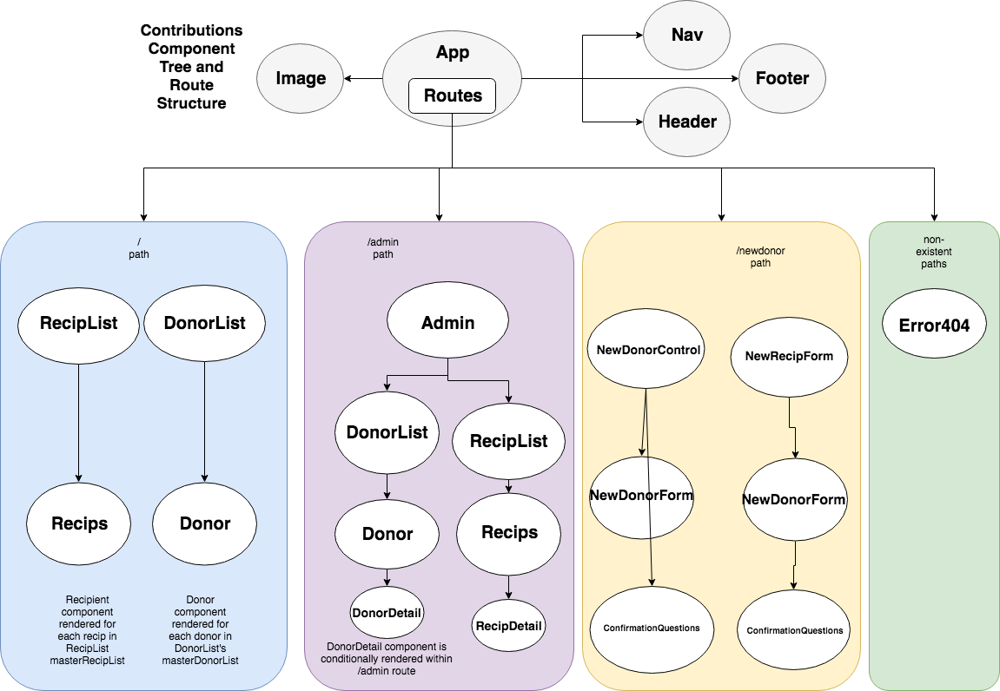

# Capstone Planning - React
## Political Contribution API Web App
#### _Andrew Lupton, 7/20/2018_

## Project Description

I propose to develop a web app that displays api data for political contributions and/or lobbyist-to-politician relationships, using the React library. Minimum features that I want to meet are as follows: a) retrieve api data, b) display api data in a visually interesting and dynamic manner, and c) manage state with Redux store. The initial static site will use hard-coded data, after which I will make calls to the ProPublica Campaign Finance API (`https://propublica.github.io/campaign-finance-api-docs/`). Second, the Google Maps API (`https://developers.google.com/maps/documentation/javascript/`) will be used to provide visual location data for the districts, or cities relevant to the database entry.

If the MVP is met, I propose allowing a user to input additional data into the app as it becomes available and then, if everything is working, to deploy the site via Firebase. The tech stack that I'll utilize will be Javascript/React-Redux/Firebase. Further planning notes will be posted here as I continue to develop the application concept.

## Intended Features
  * _Admin:_
    * Edit, delete, and add new entries.
    * View list of entries, culled from ProPublica API.
  * _User:_
    * Potentially, a portal to login via Google or Github credentials.
    * Access list item details by clicking on item.
    * Search entries by name, PAC, seat, party, etc.

## Notes

  

## Tools

* NodeJS
* React
* React-Router
* React-Redux
* Babel (transpiler)
* Jest (testing)
* HTML/CSS, JavaScript (ES6)
* Draw.io (component tree diagram)
* Firebase

## Contact

For any further questions, email Andrew Lupton at mailto:aflupton@gmail.com.

### License

*Licensed through the MIT open resource agreement*

Copyright (c) 2018 **_Andrew Lupton_**
